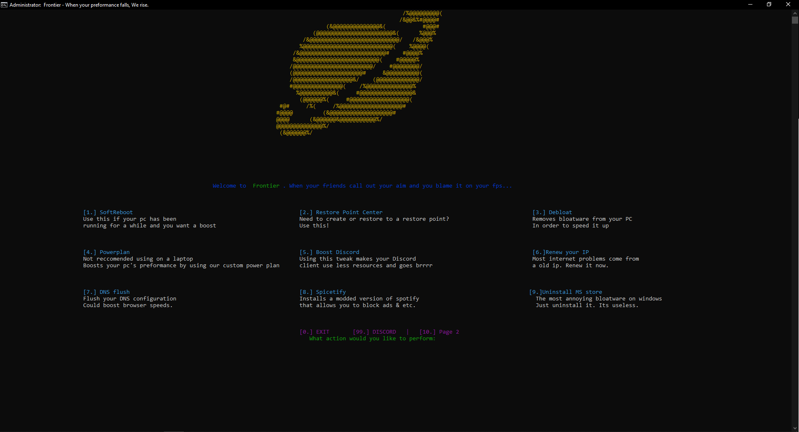

# Frontier

When your performance fails you, we come in clutch. Coming with 20+ tweaks to boost your pc performance both inside and outside of games.

## WARNING
 I don't take responsibility for any damage done to your system.

## Features

- Softreboot, for when your pc has been running for a while...
- Restore points, so you can do stuff you should not...
- debloat, so you can get rid off all the garbage
- A custom powerplan to give you every drop of performance there is.
- A discord booster. So it doesn't devour your resources anymore.
- IP renewal
- DNS flusher
- Microsoft store uninstaller. Because why are you even using it.
- Easy-to-use UI
- Developed with love <3
- There is more but im too lazy to edit the readme

## Support

If you have an questions or issues I would love to help you. Email me at visualventuredev@proton.me or join my [Discord](https://discord.gg/GkhwF53JbF).

## Installation
First launch install_requirements.bat
To use the program use run Frontier.exe 
If you need to install it either use 
`$ git clone https://github.com/VisualDeVenture/Frontier`
 and then run Frontier.exe or use the installer contained in [Github Releases](https://github.com/VisualDeVenture/Frontier/releases)

### TO DO
All done friends! Any of your suggestions you can subimit at our [Discord server](https://discord.gg/GkhwF53JbF)
- [x] Make a functioning restore point system
- [x] Make a compiled version
- [x] Make a version checking feature
- [x] Add timer resolution

    
With <3 Mr. VisualVenture
