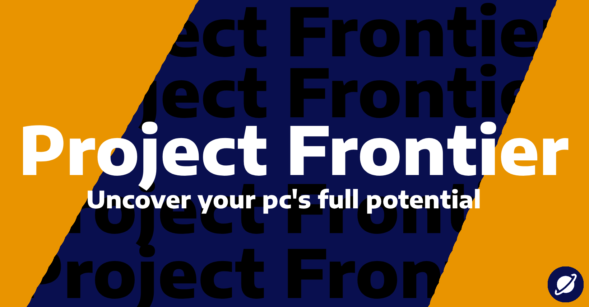
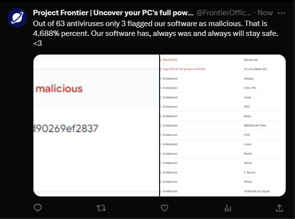
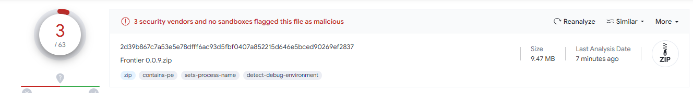
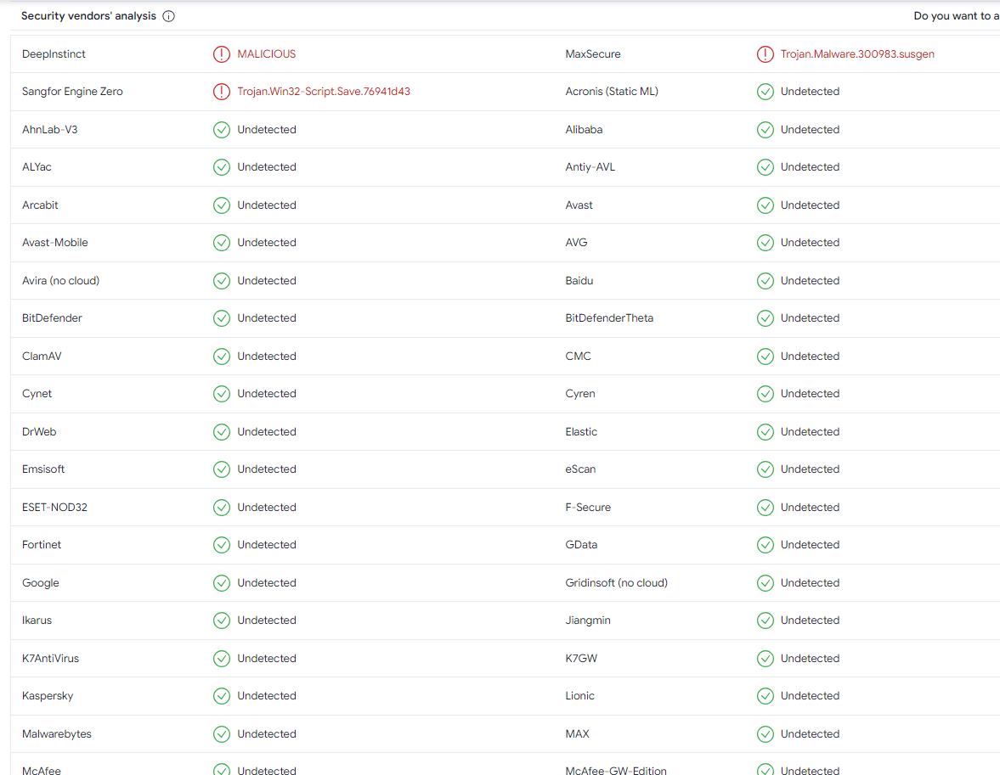

</a>
# Northstar
## When your performance fails you, we come in clutch. Coming with 40+ tweaks to boost your pc performance both inside and outside of games.

## Features

- Softreboot, for when your pc has been running for a while...
- Restore points, so you can do stuff you should not...
- debloat, so you can get rid off all the garbage
- A custom powerplan to give you every drop of performance there is.
- A discord booster. So it doesn't devour your resources anymore.
- IP renewal
- DNS flusher
- Microsoft store uninstaller. Because why are you even using it.
- Easy-to-use UI
- Developed with love <3
- There is more but im too lazy to edit the readme

# Installation (Best part)

- ## Compiled (.exe)
    1. Click [here](https://github.com/VisualDeVenture/Northstar/releases/latest) to open the latest compiled release.
    2. Download it and extract it.
    3. Run "Main.exe" as an administrator
    4. Enjoy your boosted performance

- ## Raw code (.py/un-compiled)
    ### NOTE: If you are just a normal user I strongly advise **AGAINST** using this 
    1. Clone the repository or click [here](https://github.com/VisualDeVenture/Northstar) or go to the Northstar Github page and download the raw code
    
        *Git clone command: `$ git clone https://github.com/VisualDeVenture/Northstar`*
    2. Install the required packages and libraries for the code to work properly
        
        *You can achieve this either by using `$ pip install -r requirements.txt` or by running Install_Requirements.bat*
    
    3. Run Debug_Window.exe as administrator or open a new Command prompt and navigate to the Northstar folder.
    
        **If you used the Debug Window you can stop here.**
    4. Use `$ Python main.py` (If the terminal crashes or displays any kind of error please make sure you are running your terminal as an administrator.)
    5. Enjoy your new found performance!

## Support

If you have an questions or issues I would love to help you. Email me at visualventuredev@proton.me or join my [Discord](https://discord.gg/GkhwF53JbF).

# FAQ

Q: How do I know if Northstar is safe?

 
A: We keep our services clean. Where are the morals in stealing someones data?
 

### TO DO
All done friends! Any of your suggestions you can submit at our [Discord server](https://discord.gg/GkhwF53JbF)
- [x] Make a functioning restore point system
- [x] Make a compiled version
- [x] Make a version checking feature
- [x] Add timer resolution

    
With ❤ Mr. VisualVenture

# ⚠ I don't take responsibility for any damage done to your system.
### Warning ⚠: This project is protected under a [Mozilla Public License Version 2.0](https://choosealicense.com/licenses/mpl-2.0/#) . If you are going to  use this project somewhere feel free to hit me up on Discord. I would love to see your project. <3